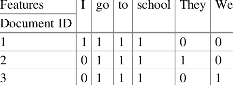
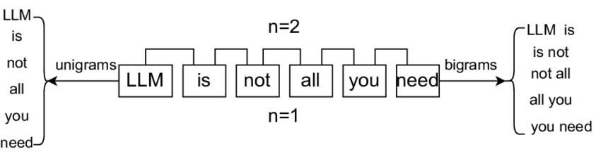
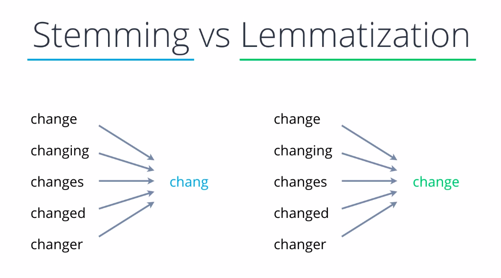

# Natural-Language-Processing

```
Natural Language processing help us to understand the text data.
```
```1. Document: one tweet, one sentence, one article, one whatapp message, one ticker is consider as documnet in NLP. Even one word is also called document. One document is basically one row of data.```

```2. Corpus: Union of all documents in your training data.```

```3. Token: Token a basically one word or one special charactor or one number which can be seperated with space. ```

```4. n-gram: some time one token contain n words which is called n-grams.```

```5. bi-grams: when one token contain 2 words it is called bi-grams.```

```6. Tokenization: Tokenization is basically splitting of documents into smaller conponents either it could be words it could be sentence or it could be charactor also, but generanlly we do not go till charactor.```

    `Word-Tokenization`: meaning if we have a string(i.e the car was fast) if i do word tokenization, it will give me the list of tokens inside the sentence. like ['The', 'Car', 'was', 'fast']

    `Sentence Tokenization`: if there are multiple sentences(i.e The car was beautiful. The car was fast.)it will give list of sentences. like ['The car was fast', 'The car was beautiful']. here the sentence sperator is [.!?]

`7. Vocabalory: Union of all the words in the corpus` <br>
The resion why we learn about this small definatin because in NLP world there is nothing called feature map or row, columns etc. we use `tokens`, `documents`, `corpus` etc

## Agenda for NLP
1. Understand the preprocessing function in NLP
2. way to convert text data into vector.
3. What are our model that helps us to understand the text data <br>
    model :- RNN, LSTM, Transformer <br>
    Throught this model we are model are solve certain problems like:
    1. Language Model
    2. Translation
    3. Summerization
    4. Named entity recognition(NER)
4. Additionally, Gernerative AI --> Specifically Large language model

-----------------------------------------------------------------
### What is NLP? Define NLP?
```
NLP is a field of study that gives the human ablity to interact with a system in natural language.
```


### What are the Challanges unique to NLP? why NLP is difficut? and why NLP has so much money?
Q. What is the __Challenges of NLP__? and why? <br>
A. There is no Universal mathematical representation of words.
```
1. Multiple Languages
2. Romonised Languages: i.e main ghar nahi jaunga.
3. Context is very Subjective. i.e apple is company or fruit.
4. Sercasm
5. Emotion
6. Humer
7. Spelling Mistake
8. Emoji
```

Q. What are the problem of NLP?
1. What is the Machanism to convert **words** into **vectors**. <br>
`A. it can be solved using embedding.`
2. How do i convert this **Vectors** into meaningful **Model** to solve some kind of problem.

### Embedding: 
Solve the problem how do I convert words to vector in meaningfull manner.
1. Frequency based
2. Prediction based

### Document Term Metrix:


#### disadvantage: 
Q1. squence of word can not be cature at all in Document Term Metrix. How can you solve it? <br>


`A: n-gram, Instead of having uni-gram in the column can i have bi-grams/tri-grams/quard-grams in the column that will acturally capture phrase instade of words to an extend sequence of problem can be solved`

Q2. Sparse Metrix
`A: Let's say if i catpute 50 thousand tweet in my corpus, what will be Vocabalory size on an average.`
`If i have 50k tweet in my corpus what could be vocabalary size.
if there is 50k tweet then i may have more then 100k indiviual token.` <br>
`limit of single tweet is 260 charactors which mean 20 to 25 words, if we put on Term Metrix, the staring 20 columns got 1,1,1,1,1,1... rest 999k will be 0,0,0,0,0...` <br>
`like same way if 2nd tweet has 15 words it present once in all 15 words and rest(100k - 15) will be zeros.` <br>
Q. How can we solve the problem of sparse metrix? <br>
`A. Our Aim is to reduce he columns, how can we do this in term of documnet term metrix` <br>
1. **Remove stopwords**: Stop words is very generic word which donot have a specfic meaning. for example, is, an, the, becasuse, couldn't etc. They are not helping us in defining words.
2. Some of the unused things in documents:
    * This step can be done using `regex`. anything appart from A-Z and a-z should be remove.
    1. Stopwords
    2. numbers
    3. charactors
    4. Hyperlink
    5. Speical charactor
    6. removing panchuation 
    7. human spelling mistake: like aa, abb, abc etc. it don't make any sence how could you remove this. <br>
3. **Stemming & lamatization**: it help us to get the root word of a verb. example run vs running, catch vs catching etc. <br>
`convert every words into there root word.` <br>
    1. Lamatization: Lamatization has english structure in term of verb, adverbe, adjective etc store in tree based data structure, lamatization has that infomation.
    * Lamatization is very logical, it understand the entire english language.
    2. stemming does not has that information, stemming is stupid, It does not have the understanding of infomation. <br>
    * it has so stupid it has given some rule like 5th class student, like if you see `caring` remove `ing`, if you see `cares` remove `es`, if you see `esses` remove `es` etc. 
    * Algorithm which are used in stemming is `porter stemming`, it is just a set of rules and don't have much knowledge of english language.
    * it is mainly used in creating `Documnet Term Metrix`. 
    * In stemming some of the pattern are correct and some of the pattern are wrong. 



### What are my use-cases in NLP? what kind of problem we can solve using NLP?
1. Document classifiction: can i take a sentence or news article, or a tweet and classifie it into certain classes. or simple classifiction problem. <br>
use-case 1: **ticket routing system**; suppose you help some techinical problem you enter the description of the problem based on the description you ticket get routed to HR, IT system, manager etc. <br>

2. Sentiment analysis: can i take some article or tweet and find out the sentiment analysis.

3. Language Model (like chatbot): like chatgpt, where we can solve multiple problem for example: <br>
**1. Summerization Probem:** given a long sentance can you do summerization. <br>
**2. Translation Probem:** Given a sentance can you convert it to some other language <br>
**3. Question Answering:** Given a question can you answer. <br>
**4. Auto Complete:** <br>
**5. Name Entity Recongnition:** for example 1, from the written text can i extract the **symptions**, **dignosis**, the **treatment steps** and the follow up **date** this is called named entity recognition.
    ```                     
                        Patient Report
    The patient was diagonised with Tythroid. the following steps were mentioned for the treatment. 
        Dolo 650 3x3
        paracetamole 1x1
        pentasharfa 2 time
        etc...
    the patient has advice to meet after 5 days.
    ```
    ```Project idea: Create an API for this and upload to AWS```

    ```
    example 2: from the transcript of the meeting can i extract the **plan of action**, the **POCs** and next meeting follow up **date**. 
    ``` 
**6. Image to Caption**: Image to **text**, Given an image and generate a **caption** to that image. <br>
**7. Text to Image**: Given an **text**, can I generate the **image**. <br>
**8. Image to Text**: OCR(combination of CV & NLP), given a **text image** can i get the **text**. <br>

*These are the things we are consider in natural language processing. early `1` chatbot solves `1` probem now take an example of `chatgpt` it do almost everything.*


### How do we create some preprocessing function on text?


### How do I crate a machine learning model in text data
-----------------------------------------------------------------
